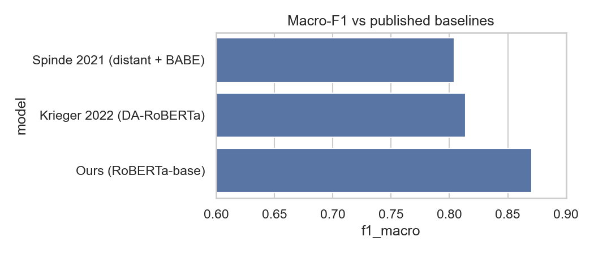

# BABE Baseline — RoBERTa Fine-tune Reproduction

Reproduction of sentence-level media bias classification on the BABE dataset (Spinde et al., EMNLP Findings 2021), using RoBERTa-base.

## Goal
Reproduce the binary biased / non-biased sentence classifier from BABE and compare against published baselines:
- Spinde et al. 2021 (distant supervision pre-train + BABE fine-tune): F1 ≈ 0.80
- Krieger et al. 2022 (DA-RoBERTa, JCDL): F1 ≈ 0.81

Target: match or exceed published baselines with a clean RoBERTa-base fine-tune (no distant supervision, no DAPT).

## Results

**5-fold stratified cross-validation on BABE:**

| Model | Macro-F1 |
|---|---|
| Spinde et al. 2021 (distant supervision + BABE) | 0.804 |
| Krieger et al. 2022 (DA-RoBERTa, DAPT, JCDL) | 0.814 |
| **This repo (RoBERTa-base, 5-fold CV)** | **0.857 ± 0.012** |



Per-fold macro-F1: 0.876, 0.854, 0.845, 0.852, 0.856. Accuracy 0.858 ± 0.012. Fold-to-fold std is ~1.2 points — the baseline is stable. A clean RoBERTa-base fine-tune exceeds both published baselines by 4–5 macro-F1 points without distant supervision or domain-adaptive pre-training.

On a held-out single-split test run (n=468), the model reaches 0.870 macro-F1 with balanced per-class recall (86.96% non-biased, 87.36% biased) and slightly higher precision on the biased class (89.4% vs 84.5%). See `results/` for confusion matrix and error analysis.

## Key findings
- A plain RoBERTa-base fine-tune is enough to reproduce the BABE task strongly: 5-fold CV reaches `0.857 ± 0.012` macro-F1, above the published baselines listed above.
- The quick held-out run reaches `0.870` macro-F1, which is slightly optimistic relative to the CV mean but consistent with the same overall result.
- Errors are concentrated in subtle framing and loaded-language cases rather than only overtly emotional or partisan wording.

For details, see:
- `notebooks/02_data_exploration.ipynb` for class balance, length statistics, and sample sentences.
- `notebooks/04_evaluation.ipynb` for confusion matrix, misclassified examples, and error analysis.
- `notebooks/05_final_report.ipynb` for the final comparison table, summary figures, and reporting-ready takeaways.

## Pipeline
The project is a pipeline of 5 notebooks, each calling functions from `src/`. Notebooks are thin orchestrators; logic lives in scripts.

| Notebook | Purpose |
|---|---|
| `01_data_preparation.ipynb` | Download BABE from HuggingFace, clean, split, save processed parquet |
| `02_data_exploration.ipynb` | Class balance, length distributions, vocab stats, sample sentences |
| `03_fine_tuning.ipynb` | Tokenize, fine-tune RoBERTa-base with HF Trainer, log to W&B |
| `04_evaluation.ipynb` | 5-fold CV scores, confusion matrix, error analysis |
| `05_final_report.ipynb` | Final plots and comparison table vs published baselines |

Run notebooks in order. Each is idempotent — re-running won't break the next.

## Project structure
```
.
├── src/                    # importable Python package
│   ├── config.py           # paths, hyperparameters, constants
│   ├── data.py             # dataset loading, splits, preprocessing
│   ├── model.py            # model + tokenizer factory
│   ├── train.py            # training loop wrapper
│   ├── evaluate.py         # metrics, k-fold CV
│   └── viz.py              # plotting helpers
├── notebooks/              # pipeline notebooks (01 → 05)
├── data/
│   ├── raw/                # untouched HF download
│   └── processed/          # cleaned parquet splits
├── models/                 # saved checkpoints
├── results/                # metrics, plots, error analysis
├── requirements.txt
└── README.md
```

## Setup
```bash
python -m venv .venv
source .venv/bin/activate
pip install -r requirements.txt
```

If you have a GPU, install the matching `torch` build first. CPU works but training will be slow — Colab / Kaggle recommended for `03_fine_tuning.ipynb`.

## Data
BABE is loaded from HuggingFace: `mediabiasgroup/BABE`. The dataset is publicly licensed for research use; see the dataset card on HF for details. No raw data is committed to git.

## Reproducibility
- Fixed seeds (`src/config.SEED = 42`)
- Pinned dependency versions in `requirements.txt`
- Processed splits saved as parquet so notebooks 02–05 don't re-download
- Final model published to HuggingFace Hub: `vulonviing/roberta-babe-baseline` (after run)
